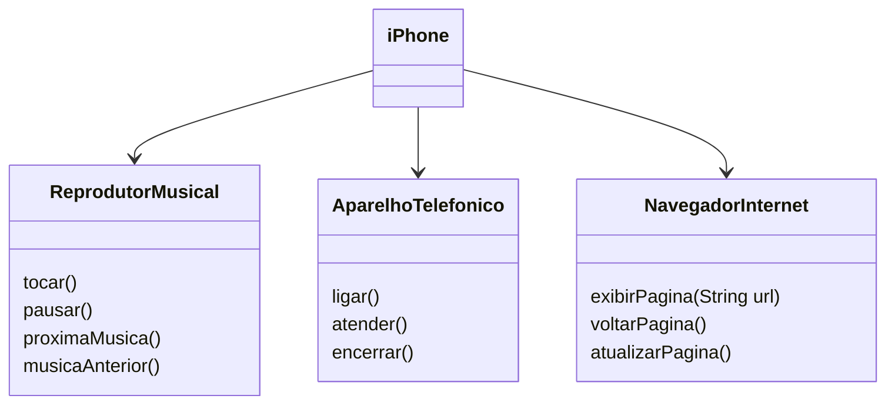

# desafio_IphoneX
Elaboração UML do primeiro iphone 
# [DIO](www.dio.me) - Trilha Java Básico

# desafio_IphoneX
Elaboração UML do primeiro iphone 

### Meu Diagrama UML elaborado no Draw io.

```mermaid
classDiagram
    class ReprodutorMusical {
        tocar()
        pausar()
        proximaMusica()
        musicaAnterior()
    }

    class AparelhoTelefonico {
        ligar()
        atender()
        encerrar()
    }

    class NavegadorInternet {
        exibirPagina(String url)
        voltarPagina()
        atualizarPagina()
    }

    class iPhone {
    }

    iPhone --> ReprodutorMusical
    iPhone --> AparelhoTelefonico
    iPhone --> NavegadorInternet
```

